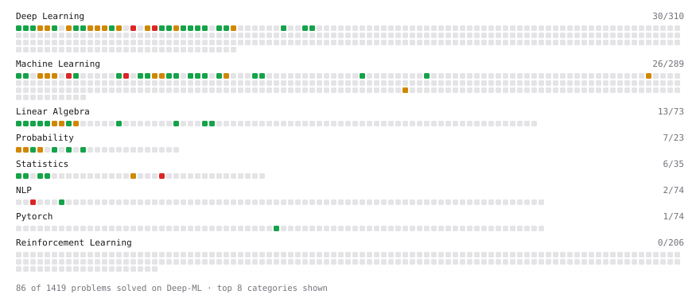

# Deep-ML

My machine learning practice from [Deep-ML](https://www.deep-ml.com). Every solution here was written by hand.

**5** solved · 5 problems · 0 labs · 0 math

[**Browse the interactive portfolio**](https://HuwWDay.github.io/deep-ml/) to replay this filling in over time.

## Problems

| | Difficulty | Solved | |
| --- | --- | --- | --- |
| [Single Linear Neuron Forward](https://www.deep-ml.com/problems/1224) | easy | 2026-09-15 | [solution](problems/1224-single-linear-neuron-forward) |
| [Numerical Gradient Checking](https://www.deep-ml.com/problems/313) | medium | 2026-09-16 | [solution](problems/0313-numerical-gradient-checking) |
| [Omitted-Variable Bias](https://www.deep-ml.com/problems/1358) | medium | 2026-09-17 | [solution](problems/1358-omitted-variable-bias) |
| [Toy Models of Superposition: Feature Reconstruction](https://www.deep-ml.com/problems/862) | medium | 2026-09-18 | [solution](problems/0862-toy-models-of-superposition-feature-reconstruction) |
| [Leverage, Studentized Residuals and Cook's Distance](https://www.deep-ml.com/problems/1363) | hard | 2026-09-21 | [solution](problems/1363-leverage-studentized-residuals-and-cook-s-distance) |

---

_This file is regenerated by Deep-ML on every push._
